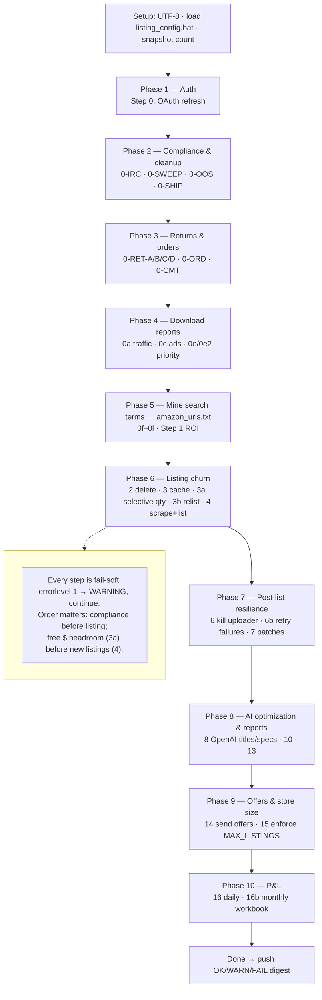

# The `airotate.bat` Pipeline

`airotate.bat` is the daily automation run — the operational heart of the store.
It executes ~30 ordered steps that together handle compliance, returns, order
monitoring, product sourcing, listing churn, AI optimization, and reporting.

Run it via **`run_airotate.bat`**, which executes this pipeline, tees output to a
timestamped log, and pushes an OK/WARN/FAIL digest notification when done.

## Flow at a glance

> **Sourcing → Listing → Optimization loop:** Phases 4–5 discover *what* to sell,
> Phase 6 lists it, Phases 8–9 optimize and promote it, and Phase 10 measures the
> result — which feeds tomorrow's decisions via `check_limits.py`.

**Design principles**
- **Fail-soft:** every step is independently guarded (`if errorlevel 1 -> WARNING,
  continue`). One failing step never aborts the run.
- **Order matters:** compliance/cleanup runs *before* listing so blacklisted or
  out-of-stock ASINs aren't re-listed; dollar-headroom is freed *before* new
  listings are attempted.
- **Tunable:** listing volume knobs come from `listing_config.bat`
  (`MIN_PRICE`, `MAX_URLS`, `MAX_LISTINGS`, `RELIST_MAX`, `DELETE_MAX`), which
  `check_limits.py` auto-adjusts against eBay headroom.

---

## Setup (top of run)

| | Command | What it does |
|---|---|---|
| — | `set PYTHONIOENCODING=utf-8` / `PYTHONUTF8=1` | Forces UTF-8 so Unicode console prints (✓, →, −) don't crash on the cp1252 Windows console — a bug that once silently blocked title/description updates. |
| — | `call listing_config.bat` | Loads the tunable listing knobs into environment variables. |
| — | `python check_limits.py --snapshot` | Records the current active-listing count so a later mid-day `check_limits.py` run can measure net growth. |

## Phase 1 — Auth

| Step | Command | What it does |
|------|---------|--------------|
| **0** | `ai_ebay_refresh_oauth_token.py` | Refreshes the eBay OAuth token using the stored refresh token (no browser). If it fails, you may need `ai_ebay_get_oauth_token.py` manually. |

## Phase 2 — Compliance & cleanup (before any listing)

| Step | Command | What it does |
|------|---------|--------------|
| **0-IRC** | `process_issue_resolution.bat` | Scrapes eBay's Issue Resolution Center for problematic listings, ends them via PriceYak, and blacklists their ASINs. Runs first so blacklisted ASINs are never re-listed later. |
| **0-SWEEP** | `ai_ebay_blacklist_sweep.py` | Pre-emptive sweep *ahead of* the IRC: ends active listings matching a blacklisted ASIN or brand, blacklists their ASINs, and syncs ASINs into the scrape filter. |
| **0-OOS** | `ai_ebay_remove_oos_listings.py --days 14` | Ends listings that PriceYak reports out of stock (quantity 0 + `oos_time`) for ≥ 14 days. OOS is not a policy violation, so these ASINs are **not** blacklisted. |
| **0-SHIP** | `ai_ebay_migrate_shipping_policy.py` | Consolidates all active listings onto the domestic-only shipping policy, keeping them off auto-created "Flat:…" policies that pick up international shipping. |

## Phase 3 — Returns & orders

| Step | Command | What it does |
|------|---------|--------------|
| **0-RET-A** | `ai_priceyak_start_returns.py` | For each new eBay return needing a label, tries a PriceYak gift-return; if that fails, opens a "Request a return label" case. |
| **0-RET-B** | `ai_ebay_upload_return_labels.py` | For returns whose PriceYak case got a support reply with a label link, downloads the PDF and uploads it to the matching eBay return case as the UPS return label. |
| **0-RET-C** | `ai_priceyak_return_case_followup.py --scan 1500 --live` | For un-refunded returns with a label > 30 days old, asks PriceYak support whether it was refunded on Amazon (replies to open cases, emails support for closed ones). Stamps "asked/emailed refund M/D/YYYY" so it never double-asks. |
| **0-RET-D** | `ai_priceyak_resolution_check.py --scan 1500 --live` | Closes the loop on 0-RET-C: re-checks stamped orders — marks "refunded" if now refunded, "no refund: <reason>" if declined, else leaves pending. |
| **0-ORD** | `ai_priceyak_order_monitor.py --scan 300 --untracked-hours 24` | Monitors PriceYak orders: alerts to ADD MONEY on funding failures, flags other failures for RETRY, and flags orders stuck without tracking > 24h. Alert-only (add `--retry` to auto-retry). |
| **0-CMT** | `ai_priceyak_update_comments.py --scan 400` | Auto-sets PriceYak order comments — "delivered" for delivered orders, "ETA M/D/YYYY" for in-transit. Only touches empty/own comments; never clobbers manual notes. |

## Phase 4 — Download performance reports

| Step | Command | What it does |
|------|---------|--------------|
| **0a** | `ai_ebay_downlaod_listings_traffic_report.py` | Downloads the active-listings traffic report from Seller Hub. |
| **0c** | `ai_ebay_download_automagical.py ebay_ads_report` | Downloads the eBay promoted-listings ads report (past 14 days). |
| **0d** | *DISABLED* | Top Converters keyword report — campaign no longer managed. |
| **0e** | `ai_ebay_download_suggested_priority_report.py` | Downloads eBay's Suggested Priority Listing report. |
| **0e2** | `ai_ebay_process_suggested_priority_report.py` | Processes that report and deactivates underperformers. |

## Phase 5 — Mine new search terms (feeds the scraper)

All write new Amazon search URLs into `amazon_urls.txt`, enforcing the `MIN_PRICE`
floor + fast-ship + 4-star filters.

| Step | Command | What it does |
|------|---------|--------------|
| **0f** | `ai_ebay_trending_to_amazon.py --min-price` | Turns eBay trending categories into Amazon search URLs. |
| **0g** | `mine_converting_keywords.py --min-price` | Adds buyer search phrases that drove impressions/clicks/sales (from the Top Converters keyword report). Self-activating — adds nothing until traffic data accrues. |
| **0h** | `mine_winner_titles.py --min-price --max 40` | Mines product-type terms from your own winning listings' titles. |
| **0i** | `amazon_keyword_expander.py --from-urls 40 --engine amazon --min-price` | Expands 40 random existing terms via Amazon autocomplete to discover related queries. |
| **0j** | `mine_amazon_movers.py --max-pages 5 --max 50 --min-price` | Mines rising/steady-demand terms from Amazon Best Sellers & Movers & Shakers. |
| **0k** | `mine_google_trends.py --from-urls 8 --rising-only --top-n 8 --sleep 4 --min-price` | Discovers rising-demand terms via Google Trends (best-effort; degrades gracefully on rate-limit). |
| **0l** | `ai_ebay_terapeak_terms.py --from-urls 6 --min-count 3 --max 40 --min-price` | Mines "what's selling across eBay" product-type phrases from Terapeak sold-listing titles. |
| **1** | `analyze_roi_and_generate_amazon_searches.py --min-price` | Analyzes ROI and generates Amazon searches from the highest-value signals. |

## Phase 6 — Listing churn (delete, size, relist, list)

| Step | Command | What it does |
|------|---------|--------------|
| **2** | `ai_process_all_listings_and_delete.bat` | Processes the latest "all listings" download and deletes up to `DELETE_MAX` (333) low performers. |
| **3** | `ebay_clear_old_item_cache.py` | Clears stale entries from the item-details cache. |
| *(4)* | *DISABLED* | `magicrotate.py` — optional deletion of unviewed old listings. |
| **3a** | `ai_ebay_selective_quantity.py --apply` | Sets unproven listings to qty 1 and proven sellers (`order_count ≥ 1`) to qty 2. eBay's **dollar** selling limit counts price × quantity, so qty-2-on-everything wastes ~half the limit on second units that never sell. Runs *before* relist/scrape so the freed dollar headroom is available for new listings. |
| **3b** | `ai_relist_proven_sellers.py --max %RELIST_MAX% --min-sales 2` | Relists ASINs that sold ≥ 2 times before but aren't currently listed (up to `RELIST_MAX` = 100). |
| **4** | `scrapeandlist_batch.bat --min-price %MIN_PRICE% --max-urls %MAX_URLS%` | The main sourcing step: scrapes a random subset of `amazon_urls.txt` (bounded by `MAX_URLS` to cap Crawlbase cost) and submits new products to PriceYak to list. |

## Phase 7 — Post-list cleanup & resilience

| Step | Command | What it does |
|------|---------|--------------|
| *(5)* | *DISABLED* | Optional wait before processing. |
| **6** | `kill_batch_uploader.py` | Kills the batch-uploader process once listing is done. |
| **6b** | `ai_priceyak_listing_failures.py --hours 24 --retry --max 300` | Monitors PriceYak listing failures and re-submits transient (fetcher) failures once PriceYak recovers. A high fetcher-error rate signals a PriceYak outage (high-priority alert). |
| **7** | *(monkey-patches)* | Applies runtime error-handling patches if available: `combined_ebay_fixes` (retry + XML), falling back to `ebay_utils_error_fixes` and `xml_entity_fixes`. |

## Phase 8 — AI optimization & reports

| Step | Command | What it does |
|------|---------|--------------|
| **8** | `test_ebay_utils.py --min-description-rating 8 --min-title-rating 8` | Runs OpenAI over listings, filling missing item specifics and rewriting titles/descriptions that score below the quality threshold (8/10). |
| *(9)* | *DISABLED* | Same optimization via a local Ollama model. |
| **10** | `generate_listing_ratings_report.py` | Generates the listing-ratings report. |
| *(11)* | *DISABLED* | Top Converters campaign bid optimization (multi-part). |
| **13** | `generate_daily_campaign_report.py` | Generates the unified daily campaign HTML report and opens it in the browser. |

## Phase 9 — Buyer offers & store-size enforcement

| Step | Command | What it does |
|------|---------|--------------|
| **14** | `ai_ebay_send_offers.py` | Sends offers to eligible buyers (5% off by default). |
| **15** | `ai_ebay_enforce_max_listings.py %MAX_LISTINGS%` | If over the store-size target, deletes zero-view listings back down to `MAX_LISTINGS`. |

## Phase 10 — Profit & Loss

| Step | Command | What it does |
|------|---------|--------------|
| **16** | `ai_daily_pnl.py` | Generates the daily P&L report. |
| **16b** | `update_pnl.py` | Updates the monthly P&L workbook for every complete month through last month: scrapes eBay revenue/net sales, refreshes the transactions tab (COGS auto-computes), computes Crawlbase cost from API usage, and writes PriceYak figures + formulas. |

---

## After the run

- `python monitor_airotate.py` — monitor for errors.
- `python diagnose_airotate_errors.py` — diagnose issues from the run log.
- `run_airotate.bat` also emits a push digest via `airotate_report.py` + `notify.py`.

## Related tuning

`check_limits.py` runs separately (scheduled a few hours after airotate) and
rewrites `listing_config.bat` based on how much eBay item/dollar headroom remains
and how much the store grew since the morning snapshot.
