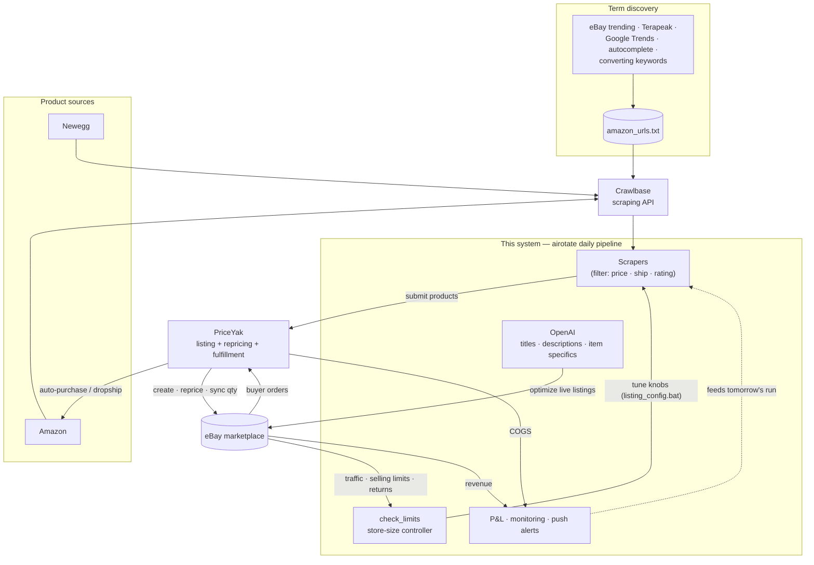

# eBay Dropshipping Automation

An end-to-end automation system for running a high-volume eBay dropshipping
store. It sources products from Amazon and Newegg, lists them on eBay via
[PriceYak](https://www.priceyak.com), keeps prices and inventory in sync,
generates AI-optimized titles and descriptions, handles returns and order
issues, and tracks profit & loss — largely unattended, driven by a single daily
pipeline.

> Built and iterated with heavy use of AI pair-programming (Claude Code). The
> repo is the operations backbone of a live store carrying ~1,300–2,600 active
> listings.

---

## Architecture at a glance



**The loop:** discover what to sell → scrape & list via PriceYak → AI-optimize on
eBay → buyer orders auto-fulfill from Amazon → eBay signals (traffic, limits,
returns, P&L) tune the next day's run. See [`AIROTATE.md`](AIROTATE.md) for the
step-by-step pipeline diagram.

---

## What it does

- **Sourcing** — scrapes Amazon/Newegg for profitable products (price floor,
  fast-shipping, 4-star filters) and mines new search terms from eBay trending
  categories, converting keywords, Terapeak, Google Trends, and autocomplete.
- **Listing** — submits products to PriceYak, which creates and reprices the
  eBay listings. AI (OpenAI) fills missing item specifics and writes optimized
  titles/descriptions, gated by a quality-rating threshold.
- **Inventory & compliance** — ends out-of-stock listings, sweeps blacklisted
  brands/ASINs ahead of eBay's Issue Resolution Center, and consolidates
  shipping policies.
- **Orders & returns** — monitors PriceYak orders for failures/funding issues,
  auto-starts returns, uploads return labels to eBay, and follows up on
  un-refunded cases.
- **Optimization** — a self-tuning controller sizes the store against eBay's
  selling limits; promoted-listing and keyword-bid tooling manage ad spend;
  offers are sent to eligible buyers.
- **Reporting** — daily and monthly P&L (COGS from PriceYak, revenue from eBay),
  listing-quality reports, and push notifications on run status.

## How it works

The heart of the system is **`airotate.bat`** — a daily pipeline that runs ~30
ordered steps. Roughly:

```
Refresh auth ─▶ Compliance/cleanup (IRC, blacklist sweep, OOS removal,
                shipping policy) ─▶ Returns & order monitoring ─▶ Download
                reports (traffic, ads) ─▶ Mine new search terms ─▶ Delete
                low performers ─▶ Selective quantity (free $ headroom) ─▶
                Relist proven sellers ─▶ Scrape & list new items ─▶ AI
                title/description optimization ─▶ Send offers ─▶ Enforce
                store size ─▶ Daily & monthly P&L
```

Two entry points:
- **`airotate.bat`** — the pipeline itself. Runs the steps; output streams to the
  console only (nothing saved, no notification). Use directly for interactive
  debugging.
- **`run_airotate.bat`** — the wrapper you normally run (scheduled or manual). It
  executes `airotate.bat` but tees the output to a timestamped `logs\` file, then
  runs `airotate_report.py` to push an **OK/WARN/FAIL digest** notification when
  the run finishes. In short: `run_airotate.bat = airotate.bat + saved log + alert`.

`check_limits.py` runs separately to tune the listing knobs (in
`listing_config.bat`) against eBay's item/dollar headroom.

**See [`AIROTATE.md`](AIROTATE.md) for a step-by-step breakdown of every stage
in the pipeline.**

### Notable engineering

- **Self-tuning listing controller** (`check_limits.py`) — scales scrape volume
  and store-size targets up/down based on live eBay headroom and net growth.
- **Selective quantity** (`ai_ebay_selective_quantity.py`) — eBay's dollar
  selling limit counts price × quantity, so it keeps unproven listings at qty 1
  and only bumps proven sellers to qty 2, reclaiming ~half the dollar limit so
  the store can grow.
- **Aggressive caching** — every eBay/LLM call is cached on disk (`.cache_*/`,
  `.ebay_api_cache/`) to minimize cost and rate-limit exposure.
- **Resilient runs** — each pipeline step is independently guarded; a failure
  logs a warning and continues rather than aborting the whole run.

## Tech stack

Python 3.10 · eBay Trading & REST APIs · PriceYak API · OpenAI (GPT-4o) ·
Crawlbase (scraping) · Playwright & Selenium (browser automation) · Flask
(phone remote-control panel) · pandas/openpyxl (data & Excel).

## Repository layout

| Path | What |
|------|------|
| `airotate.bat`, `run_airotate.bat` | The daily automation pipeline |
| `ebay_utils.py` | Core eBay API + OpenAI helpers, caching |
| `config.py` | Central secret/config loader (env / `.env`) |
| `ai_ebay_*.py`, `ai_priceyak_*.py` | Current-generation task scripts |
| `mine_*.py`, `scrape_*.py`, `amazon_*.py` | Sourcing & keyword discovery |
| `check_limits.py`, `listing_config.bat` | Store-size controller + knobs |
| `pnl_month.py`, `ai_daily_pnl.py`, `update_pnl.py` | Profit & loss |
| `remote_control_server.py` | Flask panel for phone-based control |
| `test_*.py` | Ad-hoc verification scripts |
| `archive/` | Legacy/experimental scripts (gitignored, kept for reference) |
| `CLAUDE.md` | Detailed operator notes & named task reference |

## Setup

```bash
# 1. Install dependencies
pip install -r requirements.txt

# 2. Configure secrets (never committed — see .gitignore)
cp .env.example .env                              # PriceYak / OpenAI / eBay cert
cp credentials.example.txt credentials.txt        # eBay app keys, OAuth, login
cp crawlbase_creds.example.txt crawlbase_creds.txt

# ...then fill in real values.
```

All secrets are loaded through `config.py`, which reads environment variables,
a local `.env`, and `credentials.txt`. **No secret values live in source code.**

## Running

```bash
# Full daily pipeline
run_airotate.bat

# Tune store size against eBay limits (scheduled a few hours after airotate)
python check_limits.py

# Monthly cost of goods sold from PriceYak
python pnl_month.py --year 2026 --month 6

# Phone remote-control panel (named tasks as buttons)
python remote_control_server.py            # http://<PC-IP>:5000
```

See **`CLAUDE.md`** for the full catalog of named dispatch tasks (ad reports,
keyword-bid updates, offer campaigns, OAuth refresh, etc.) and operator notes.

## Security

- Real credentials live only in gitignored files (`credentials.txt`,
  `crawlbase_creds.txt`, `.env`) — never in tracked source.
- `.example` templates document the required keys without exposing values.
- If these credentials were ever shared, rotate the eBay password, Gmail app
  password, and PriceYak/Crawlbase API keys.
